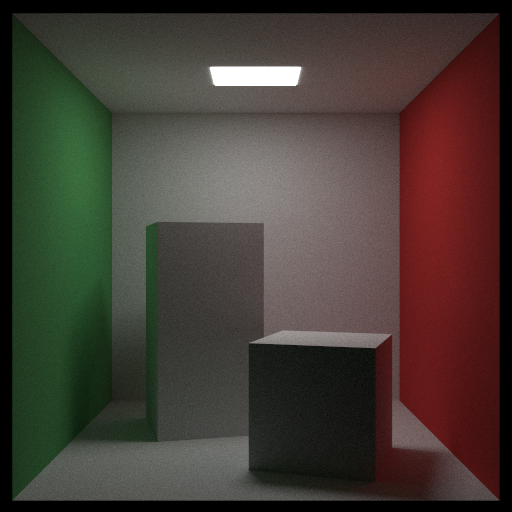
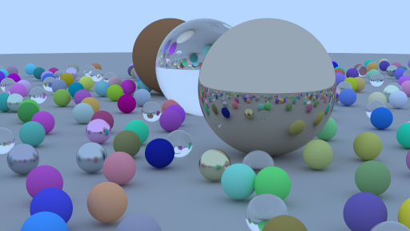

# KOV-Ray

This is scene discribing language for Ray Tracing of Computer Graphics.

This is inspired by [POV-Ray](https://www.povray.org/).

This software is written in Rust and the ray-tracing engine is [toy-ray-racer-rs](https://github.com/SNKK62/toy-ray-tracer-rs) I developed.

### How to run

```sh
cargo run --release --features execution -- -o <output_path> <scene_file_path>
```

### Examples

#### Cornell Box

<details>
<summary>Scene description</summary>
<div>

```
Camera {
    lookfrom: <278, 278, -800>,
    lookat: <278, 278, 0>,
    dist_to_focus: 10,
    angle: 40,
}

RED = 255 * (<0.05, 0.05, 0.05> + <0.6, 0, 0>);
GRAY = <186.15, 186.15, 186.15>;
GREEN = <30.60, 114.75, 38.25>;
WHITE = <255, 255, 255>;
BLACK = <0, 0, 0>;

Config {
    width: 512,
    height: 512,
    samples_per_pixel: 10000,
    max_depth: 100,
}

// YZRect
Plane {
    vertex: (<555, 0, 0>, <555, 555, 555>),
    material: Lambertian(Solid(GREEN)),
}

// YZRect
Plane {
    vertex: (<0, 0, 0>, <0, 555, 555>),
    material: Lambertian(Solid(RED)),
}

// XZRect
Plane {
    vertex: (<213, 554, 227>, <343, 554, 332>),
    material: Light(WHITE, 15),
}

// XZRect
Plane {
    vertex: (<0, 0, 0>, <555, 0, 555>),
    material: Lambertian(Solid(GRAY)),
}

// XZRect
Plane {
    vertex: (<0, 555, 0>, <555, 555, 555>),
    material: Lambertian(Solid(GRAY)),
}

// XYRect
Plane {
    vertex: (<0, 0, 555>, <555, 555, 555>),
    material: Lambertian(Solid(GRAY)),
}

Box {
    vertex: (<0, 0, 0>, <165, 330, 165>),
    material: Lambertian(Solid(GRAY)),
    rotateY: 15,
    translate: <265, 0, 295>,
}

Box {
    vertex: (<0, 0, 0>, <165, 165, 165>),
    material: Lambertian(Solid(GRAY)),
    rotateY: -18,
    translate: <130, 0, 65>,
}
```
</div>
</details>

##### Output



#### Random Balls

<details>
<summary>Scene description</summary>
<div>

```
Camera {
    lookfrom: <13, 2, 3>,
    lookat: <0, 0, 0>,
    dist_to_focus: 10,
    angle: 20,
}

Config {
    width: 512,
    height: 512 * 9 / 16,
    samples_per_pixel: 1000,
    max_depth: 100,
    background: <255 * 0.5, 255 * 0.7, 255>,
}

GRAY = <127.5, 127.5, 127.5>;
// Ground
Sphere {
    center: <0.0, -1000.0, 0.0>,
    radius: 1000,
    material: Lambertian(Solid(GRAY)),
}

a = -11;
b = -11;

while a < 11 {
    b = -11; // init b
    while b < 11 {
        choose_mat = rand();
        radius = 0.2;
        center_x = a + 0.9 * rand();
        center_y = 0.2;
        center_z = b + 0.9 * rand();

        // distance between (4, 0.2, 0) and center
        length = sqrt(pow((center_x - 4), 2) + pow((center_y - radius), 2) + pow(center_z, 2));

        if length > 0.9 {
            if choose_mat < 0.7 {
                ALBEDO = <255 * rand(), 255 * rand(), 255 * rand()>;
                Sphere {
                    center: <center_x, center_y, center_z>,
                    radius: radius,
                    material: Lambertian(Solid(ALBEDO)),
                }
            } else if choose_mat < 0.85 {
                ALBEDO = <255 * (0.5 + rand() / 2), 255 * (0.5 + rand() / 2), 255 * (0.5 + rand() / 2)>;
                fuzz = rand() / 2;
                Sphere {
                    center: <center_x, center_y, center_z>,
                    radius: radius,
                    material: Metal(ALBEDO, fuzz),
                }
            } else {
                Sphere {
                    center: <center_x, center_y, center_z>,
                    radius: radius,
                    material: Dielectric(1.5),
                }
            }
        }
        b = b + 1;
    }
    a = a + 1;
}

Sphere {
    center: <0, 1, 0>,
    radius: 1,
    material: Dielectric(1.5),
}

Sphere {
    center: <-4.0, 1.0, 0>,
    radius: 1,
    material: Lambertian(Solid(<255 * 0.4, 255 * 0.2, 255 * 0.1>)),
}

Sphere {
    center: <4.0, 1.0, 0.0>,
    radius: 1,
    material: Metal(<255 * 0.7, 255 * 0.6, 255 * 0.5>, 0),
}
```
</div>
</details>

##### Output



## Syntax

### Tables of Contents

- [Camera](#camera)
- [Config](#config)
- [Objects](#objects)
  - [Sphere](#sphere)
  - [Plane](#plane)
  - [Box](#box)
  - [Group](#group)
- [Materials](#material)
  - [Lambertian](#lambertian)
  - [Metal](#metal)
  - [Dielectric](#dielectric)
  - [Light](#light)
- [Textures](#texture)
  - [Solid](#solid)
  - [Checker](#checker)
  - [Perlin](#perlin)
- [Vec3](#vec3)
- [Variables](#variables)
- [While Statement](#while-statement)
- [If Statement](#if-statement)
- [Supported Functions](#supported-functions)

### Camera <a name="camera"></a>

```
Camera {
    lookfrom: <13, 2, 3>,
    lookat: <0, 0, 0>,
    up: <0, 1, 0>,
    dist_to_focus: 10,
    angle: 20,
}
```

#### Options

| Option | Type | Description |
| --- | --- | --- |
| lookfrom | [Vec3](#vec3) | Position of the camera |
| lookat | [Vec3](#vec3) | Position of the camera is looking at |
| up(optional) | [Vec3](#vec3) | Up vector of the camera (default: <0, 1, 0>) |
| dist_to_focus(optional) | number | Distance to focus (default: 10.0)|
| angle | number | Angle of the camera |


### Confnig <a name="config"></a>

```
Config {
    width: 800,
    height: 600,
    samples_per_pixel: 100,
    max_depth: 50,
    background: <0, 0, 0>,
}
```

#### Options

| Option | Type | Description |
| --- | --- | --- |
| width | number | Width of the image |
| height | number | Height of the image |
| samples_per_pixel | number | Number of samples for anti-aliasing |
| max_depth(optional) | number | Maximum depth of the ray(default: 100)|
|background(optional) | [Vec3](#vec3) | Color of the background(default: <0, 0, 0>)|

#### Options

| Option | Type | Description |
| --- | --- | --- |
| width | number | Width of the image |
| height | number | Height of the image |
| samples | number | Number of samples for anti-aliasing |

### Objects <a name="objects"></a>

#### Sphere <a name="sphere"></a>

```
Sphere {
    center: <0, 0, 0>),
    radius: 5,
    material: Lambertian(Solid(<0, 0, 0>)),
    translate: <1, 2, 3>,
    rotateX: 20,
}
```

##### Options

| Option | Type | Description |
| --- | --- | --- |
| center | [Vec3](#vec3) | Center of the sphere |
| radius | number | Radius of the sphere |
| material | [Material](#material) | Material of the sphere |
| translate(optional) | [Vec3](#vec3) | Translation of the sphere |
| rotateX(optional) | number | Rotation of the sphere in X-axis |
| rotateY(optional) | number | Rotation of the sphere in Y-axis |
| rotateZ(optional) | number | Rotation of the sphere in Z-axis |

#### Plane <a name="plane"></a>

```
Plane {
    vertex: (<0, 0, 0>, <2, 2, 0>),
    material: Metal(<100, 100, 0>, 0.3),
}
```

##### Options

| Option | Type | Description |
| --- | --- | --- |
| vertex | (Vec3, Vec3) | Two vertices which are opposite of the plane (one of <x, y, z> must be same) |
| material | [Material](#material) | Material of the plane |
| translate(optional) | [Vec3](#vec3) | Translation of the plane |
| rotateX(optional) | number | Rotation of the plane in X-axis |
| rotateY(optional) | number | Rotation of the plane in Y-axis |
| rotateZ(optional) | number | Rotation of the plane in Z-axis |

#### Box <a name="box"></a>

```
Box {
    vertex: (<0, 0, 0>, <2, 2, 2>),
    material: Metal(<100, 100, 0>, 0.3),
}
```

##### Options

| Option | Type | Description |
| --- | --- | --- |
| vertex | (Vec3, Vec3) | Two vertices which are opposite of the box |
| material | [Material](#material) | Material of the box |
| translate(optional) | [Vec3](#vec3) | Translation of the box |
| rotateX(optional) | number | Rotation of the box in X-axis |
| rotateY(optional) | number | Rotation of the box in Y-axis |
| rotateZ(optional) | number | Rotation of the box in Z-axis |

#### Group <a name="group"></a>

```
Objs {
    Sphere {
        center: <0, 0, 0>),
        radius: 5,
        material: Lambertian(Solid(<0, 0, 0>)),
        translate: <1, 2, 3>,
        rotateX: 20,
    }
    Box {
        vertex: (<0, 0, 0>, <2, 2, 2>),
        material: Metal(<100, 100, 0>, 0.3),
    }
    translate: <1, 2, 3>,
    rotateX: 20,
}
```

This is a group of objects. You can put any objects in this.

##### Options

| Option | Type | Description |
| --- | --- | --- |
| translate(optional) | [Vec3](#vec3) | Translation of the group |
| rotateX(optional) | number | Rotation of the group in X-axis |
| rotateY(optional) | number | Rotation of the group in Y-axis |
| rotateZ(optional) | number | Rotation of the group in Z-axis |

### Materials <a name="material"></a>

#### Lambertian <a name="lambertian"></a>

```
Lambertian(Solid(<0, 0, 0>))
```

##### Parameters

- [Texture](#texture)

#### Metal <a name="metal"></a>

```
Metal(<100, 100, 0>, 0.3)
```

##### Parameters

- [Vec3](#vec3): Color
- number: Fuzziness

#### Dielectric <a name="dielectric"></a>

```
Dielectric(1.5)
```

##### Parameters

- number: Refractive index

##### Light <a name="light"></a>

```
Light(<100, 100, 100>, 10)
```

##### Parameters

- [Vec3](#vec3): Color
- number: Intensity

### Textures <a name="texture"></a>

#### Solid <a name="solid"></a>

```
Solid(<0, 0, 0>)
```

##### Parameters

- [Vec3](#vec3): Color

#### Checker <a name="checker"></a>

```
Checker(Solid(<0, 0, 0>), Perlin(0.3))
```

##### Parameters

- [Texture](#texture): Texture1
- [Texture](#texture): Texture2

#### Perlin (Noise) <a name="perlin"></a>

```
Perlin(0.3)
```

##### Parameters

- number: Scale

### Vec3 <a name="vec3"></a>

```
<0, 0, 0>
```

You can calculate with Vec3 like below.

```
<1, 2, 3> * <4, 5, 6> // -> <4, 10, 18>
<1, 2, 3> + <4, 5, 6> // -> <5, 7, 9>
<1, 2, 3> - <4, 5, 6> // -> <-3, -3, -3>
2 * <1, 2, 3> // -> <2, 4, 6>
<1, 2, 3> * 2 // -> <2, 4, 6>
<1, 2, 3> / 2 // -> <0.5, 1, 1.5>
```

##### Parameters

If position
- number: x
- number: y
- number: z

If color (0-255)
- number: r
- number: g
- number: b

### Variables <a name="variables"></a>

You can define and use variables in the scene file.<br>
Variable can be used as a number or a [Vec3](#vec3).
```
n = 10;
```

### While Statement <a name="while-statement"></a>

```
n = 0;
While n < 10 {
    Sphere {
        center: <n, 0, 0>),
        radius: 0.5,
        material: Lambertian(Solid(<0, 0, 0>)),
    }
    n = n + 1;
}
```

### If Statement <a name="if-statement"></a>

```
n = 10;
If n < 10 {
    Sphere {
        center: <0, 0, 0>),
        radius: 0.5,
        material: Lambertian(Solid(<0, 0, 0>)),
    }
}
```

### Supported Functions <a name="supported-functions"></a>

- `sqrt(x: number) -> number`
- `sin(x: number) -> number`
- `cos(x: number) -> number`
- `tan(x: number) -> number`
- `asin(x: number) -> number`
- `acos(x: number) -> number`
- `atan(x: number) -> number`
- `atan2(y: number, x: number) -> number`
- `pow(x: number, n: number) -> number`
- `exp(x: number) -> number`
- `log(x: number, base: number) -> number`
- `log10(x: number) -> number`
- `rand() -> number(0.0-1.0)`

